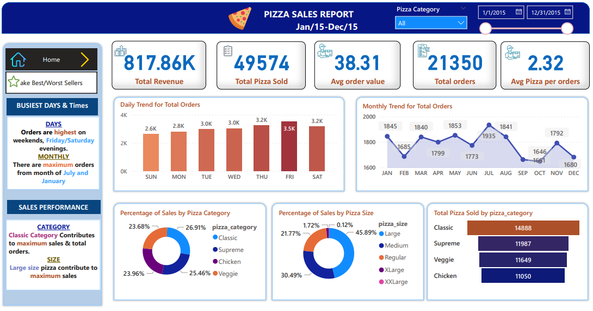
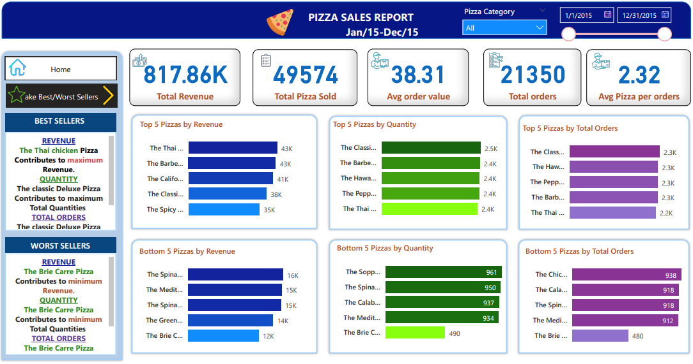

Power BI 

# [Pizza-Sales-Report](https://akedataanalyst.github.io/Pizza-Sales-Report/)

## Objective: 
- Analyzed pizza sales data (Jan–Dec 2015) to uncover operational insights and support business decision-making.

## Tools: 
- Power BI, Excel

## Key Contributions:

### Developed interactive dashboards visualizing:

- Daily and monthly order trends

- Sales by pizza size and category

- Best/worst selling pizzas by revenue, quantity, and total orders

### Derived actionable insights:

- Peak sales periods: Fridays, Saturdays, July & January

- Top performers: Thai Chicken and Classic Deluxe pizzas

- Low performers: Brie Carre and Mediterranean pizzas

### Calculated key KPIs: 
- total revenue ($817.86K), average order value ($38.31), average pizzas per order (2.32)

### Enhanced decision-
- making through root cause analysis of poor-performing products and visual storytelling

## Outcome: 
- Helped stakeholders quickly understand patterns and optimize inventory, marketing, and delivery timing strategies.

# Thank You for Your Time!
